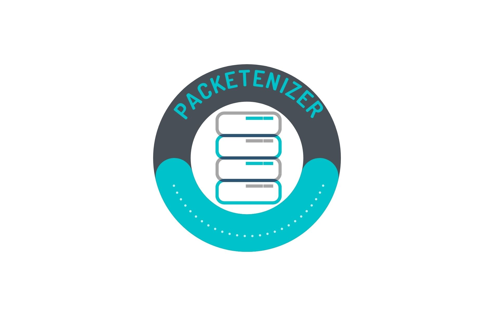

# PACKETENIZER

Packetenizer is a project developed by Kunal Joshi, Jainam Joshi and Brijesh Ghonia for our Diploma 3rd Year Project.
Various aspects of this project are covered in modules.md, project.md files.

## Setup
- You can use Docker to run the application
- For running directly refer `./source/README.md`
- Please create environment variables as referred in `.env.example` file
- If you are using Docker, remember to rename `.env.example` to `.env`
- In root of project simply run `docker-compose up --build`
- Once image is built, the application will be visible on `http://localhost:5000` 🥳